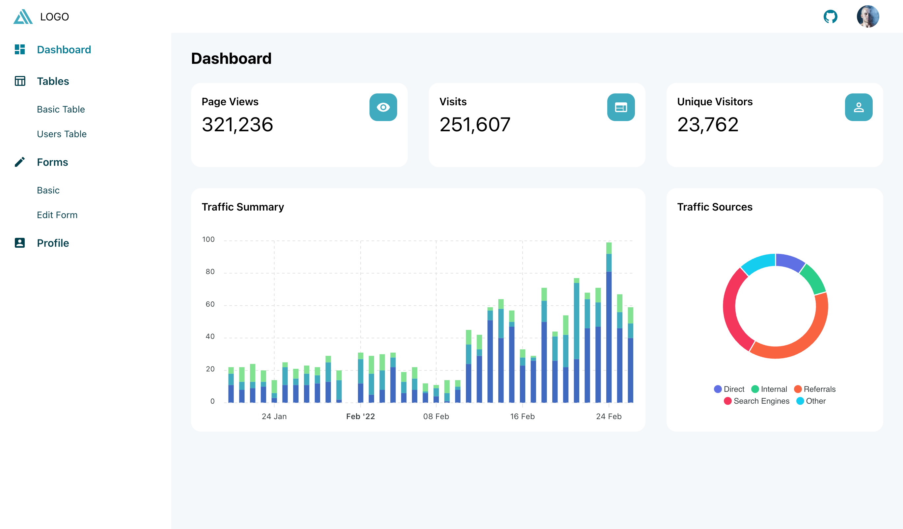

# Amplify UI Dashboard

A React Dashboard Admin Template built on top of Amplify UI.

Live Demo: [https://amplify-ui-dashboard-demo.vercel.app/](https://amplify-ui-dashboard-demo.vercel.app/).

Amplify UI Docs: [https://ui.docs.amplify.aws/react/getting-started/introduction](https://ui.docs.amplify.aws/react/getting-started/introduction).



## Setup

Fork this repo to your namespace and clone it to your local machine.

Clone:

```
git clone https://github.com/<YOUR NAME>/amplify-ui-dashboard.git
```

install dependencies:

```
npm install
```

run the app in dev mode

```
npm run dev
```


This section has moved here: [https://facebook.github.io/create-react-app/docs/troubleshooting#npm-run-build-fails-to-minify](https://facebook.github.io/create-react-app/docs/troubleshooting#npm-run-build-fails-to-minify)

## License

MIT
